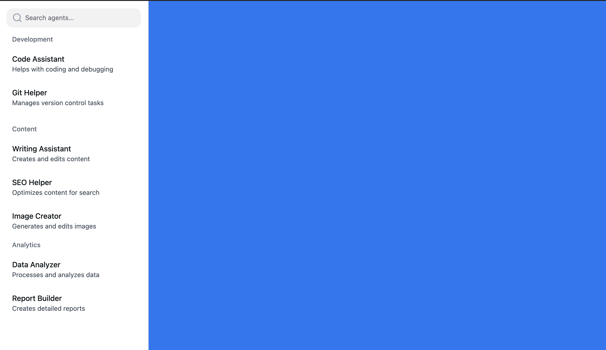

# 测试题1: Agent 侧边栏列表功能测试题

## 环境配置要求
1. 基于提供的项目模板，创建新分支：`feature/agent-sidebar`
2. 完成 NextUI、Storybook 的安装和基础配置

### 功能要求

1. **路由与布局**
   - 实现路由 `/main` 
   - 页面分为左侧边栏和主内容区
   - 主内容区使用 `#0070F3` 蓝色背景色铺满

2. **Agent 侧边栏组件**
   - 固定宽度 280px
   - 实现 Agent 列表展示
   - 每个 Agent 项包含:
     - Agent 头像 (使用 Iconify 图标)
     - Agent 名称
     - Agent 描述文本
     - Hover 时显示更多操作按钮

3. **交互功能**
   - Agent 搜索功能（实时过滤）
   - Hover 展示的更多操作菜单:
     - 删除 Agent
     - 重命名 Agent

4. **数据处理**
   - 创建 Next.js API Route 提供 mock 数据
   - API 路径: `/api/agents`
   - Mock 数据结构:
     ```typescript
     interface Agent {
       id: string;
       name: string;
       description: string;
       avatarIcon: string;
     }
     ```

### 技术要求
1. 使用 TypeScript 
2. 使用 NextUI 组件库
3. 实现响应式布局
4. 编写基础 Storybook 文档

### 完成标准
1. 代码提交到指定分支
2. 组件功能完整可用
3. TypeScript 类型完备
4. 页面布局合理美观


需要在 2-3 天内完成并提交代码PR审核。



